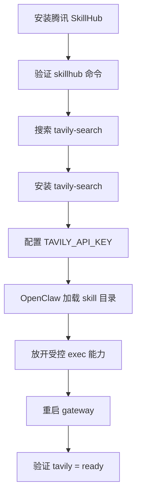

# OpenClaw + SkillHub Windows 适配版

面向国内用户整理的 Windows 版 SkillHub + OpenClaw 使用方案。

这个仓库解决的是一条完整链路：

1. 在 Windows 上安装腾讯 SkillHub
2. 让 OpenClaw 识别并启用 SkillHub 插件
3. 通过 `skillhub` 安装 `Tavily Web Search`
4. 配置 `TAVILY_API_KEY`
5. 让聊天中的 OpenClaw agent 能 safe 执行 `skillhub install ...`

## 适合谁

- Windows 用户
- 想在 OpenClaw 里使用 Skills
- 想要更顺畅的国内下载体验
- 不想自己反复踩安装、权限、路径、编码问题

## 仓库内容

- `dist/skillhub-windows-package/`
  Windows 版 SkillHub 打包资源
- `dist/skillhub-windows-openclaw.zip`
  可直接下载的压缩包
- `docs/github-article.md`
  GitHub 技术文档版文章
- `examples/env.example`
  环境变量示例

## 快速开始

### 1. 下载打包版

下载 `dist/skillhub-windows-openclaw.zip`，解压到任意目录。

### 2. 执行安装脚本

在 PowerShell 中运行：

```powershell
powershell -ExecutionPolicy Bypass -File .\install-skillhub-openclaw-windows.ps1
```

脚本会完成这些事：

- 把 SkillHub runtime 复制到 `~/.skillhub`
- 把 `skillhub.cmd` / `clawhub.cmd` 复制到 `%APPDATA%\npm`
- 把 SkillHub 插件复制到 `~/.openclaw/extensions/skillhub`
- 尝试启用 OpenClaw 插件配置

### 3. 验证 SkillHub CLI

```powershell
skillhub --help
skillhub search tavily-search
```

### 4. 安装 Tavily Search

```powershell
skillhub install tavily-search
```

### 5. 配置 Tavily Key

参考 `examples/env.example`，将 `TAVILY_API_KEY` 配到本地环境或 OpenClaw skill 配置中。

### 6. 重启并验证 OpenClaw

```powershell
openclaw gateway restart
openclaw skills list
openclaw skills info tavily
```

## 推荐的 OpenClaw 工具配置

为了让聊天中的 agent 可以安全执行 `skillhub install ...`，推荐在 `~/.openclaw/openclaw.json` 中使用：

```json
{
  "tools": {
    "profile": "messaging",
    "allow": [
      "group:runtime",
      "group:fs"
    ],
    "exec": {
      "host": "gateway",
      "security": "allowlist",
      "ask": "on-miss"
    }
  }
}
```

## 流程图



## 已知问题

- Windows 某些控制台下，`skillhub search` 可能因 GBK 编码报 `UnicodeEncodeError`
- 如果聊天里提示“当前会话没有可用的命令执行工具”，问题通常不在 SkillHub，而在 OpenClaw 工具权限

## 安全说明

- 本仓库所有示例中的密钥、Token、账号信息均应脱敏
- 不要把真实 `env.local` / `env1.local` / `openclaw.json` 中的敏感值直接提交到 GitHub

## 文档

- [GitHub 技术文档](./docs/github-article.md)

## 关注我

如果您觉得这个项目对您有帮助，欢迎关注我的微信公众号获取更多 AI 技术分享：

<p align="center">
  
</p>
